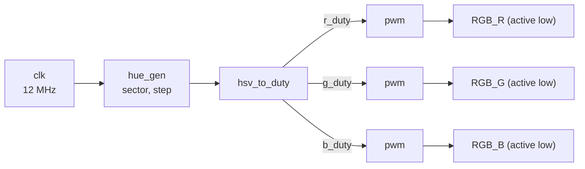

# ENGR 3410 Miniproject 2: HSV Color Wheel

Drives the RGB LED on the iceBlinkPico (iCE40UP5K) with PWM so it cycles smoothly
around the HSV color wheel once per second. Written in SystemVerilog, simulated with
Icarus Verilog, built with the OSS CAD Suite (yosys / nextpnr / icepack).

- **Plan and checklist:** [docs/PLAN.md](docs/PLAN.md)
- **Report outline:** [docs/report_outline.md](docs/report_outline.md)
- **Demo video:** _TODO: link_

## Repository layout

```
src/
  top.sv            top level: wires the blocks together, active-low LED outputs
  hue_gen.sv        walks hue around the wheel: (sector 0-5, step 0-249)
  hsv_to_duty.sv    hue -> R, G, B duty cycles (combinational)
  pwm.sv            duty cycle -> PWM output
tb/
  top_tb.sv         test bench: simulates 1.1 s (one full cycle + margin)
iceBlinkPico.pcf    iceBlinkPico board pin map
sim.bat             compile + run simulation -> sim/top_tb.fst
wave.bat            open the waveform in GTKWave
build.bat           synthesize + place & route + pack (build.bat prog also uploads)
docs/               plan, report outline
images/             GTKWave screenshots etc. for the report
```

## Design



The hue angle 0-360° is split into **6 sectors of 60°**. In every sector each color
channel is one of: fully off, fully on, ramping up, or ramping down. That makes the
hue-to-RGB mapping a 6-row lookup table plus two ramp expressions, with no
multipliers needed.

### Timing math

| Quantity | Value | Why |
|---|---|---|
| Clock | 12 MHz | iceBlinkPico oscillator |
| PWM period | 250 clocks | 12 MHz / 250 = **48 kHz** PWM, no visible flicker |
| Duty resolution | 0-250 (251 levels) | duty = number of clocks the output is high per period |
| Steps per sector | 250 | ramp value = step, so it maps directly onto duty |
| Hue steps per second | 6 × 250 = 1500 | |
| Clocks per hue step | 12,000,000 / 1500 = **8000** | exact, so one cycle is exactly 1.000 s |

## Running it

Open a Command Prompt and load the OSS CAD Suite environment first:

```
C:\Users\pbonthu\Downloads\oss-cad-suite-windows-x64-20260922\oss-cad-suite\environment.bat
cd C:\Users\pbonthu\comparchmp-2
```

| Command | What it does |
|---|---|
| `sim.bat` | Runs the test bench, writes `sim\top_tb.fst` |
| `wave.bat` | Opens the waveform in GTKWave |
| `build.bat` | Builds `build\mp2.bin` |
| `build.bat prog` | Builds and uploads to the board over USB |

### Getting the analog plot in GTKWave

1. Expand `top_tb` → `dut` and add `r_duty`, `g_duty`, `b_duty`.
2. Select all three, then right-click → **Data Format → Analog → Step** (or Interpolated).
3. Right-click → **Insert Analog Height Extension** a few times so the traces are tall enough to read.
4. Zoom to fit (the magnifying glass with the box) so the full 1 s cycle is visible.
5. Save the screenshot to `images/` for the report.
